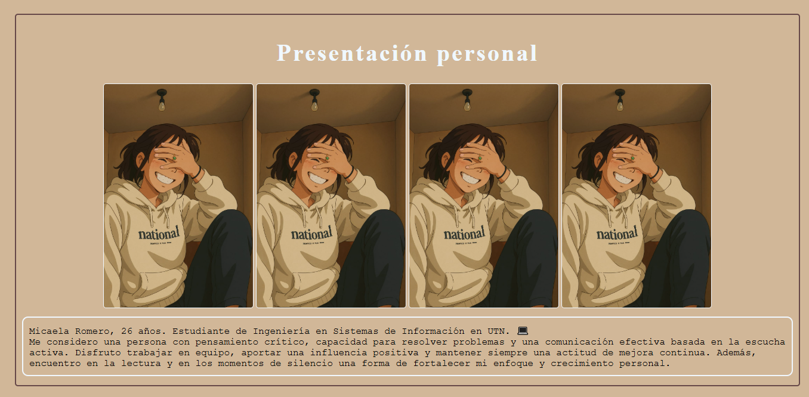

# Trabajo Presentación



Este proyecto es una página web desarrollada como parte de una actividad académica. Su objetivo es presentar una introducción personal de manera clara y profesional, destacando habilidades, intereses y perfil académico.

## 🌐 Sitio en línea

Podés ver el sitio funcionando acá:  
👉 [https://micaromero-mr.github.io/trabajo-presentacion/](https://micaromero-mr.github.io/trabajo-presentacion/)

## 🛠️ Tecnologías utilizadas

- HTML5
- CSS3

## 📄 Contenido

La página contiene:
- Una presentación personal
- Descripción de habilidades blandas y duras
- Gustos e intereses
- Estilo limpio y responsivo

## 🚀 Cómo clonar este repositorio

```bash
git clone https://github.com/micaromero-mr/trabajo-presentacion.git
